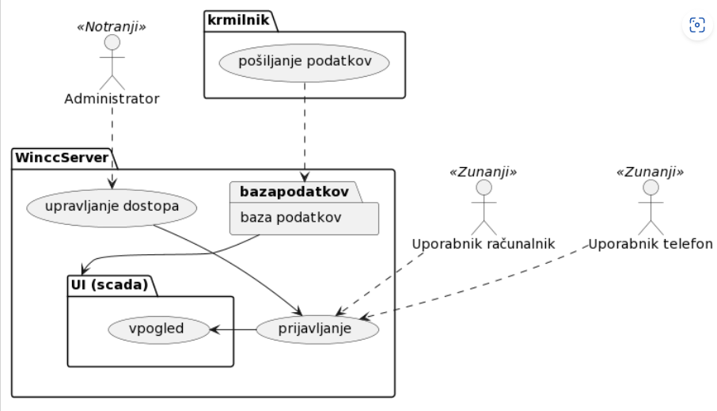

@startuml

actor "Uporabnik računalnik" as uporabnikr <<Zunanji>>
actor "Uporabnik telefon" as uporabnikt <<Zunanji>>
actor "Administrator" as admin <<Notranji>>

package WinccServer {
  usecase prijavljanje
  usecase "upravljanje dostopa" as dostop

  package "UI (scada)" as UI {
    usecase vpogled
  }

  package "baza podatkov" as bazapodatkov{
  }
}

package krmilnik {
  usecase "pošiljanje podatkov" as pošiljanje
}
pošiljanje ..> bazapodatkov
admin ..> dostop
uporabnikr ..> prijavljanje
uporabnikt ..> prijavljanje
prijavljanje -> vpogled
dostop --> prijavljanje
bazapodatkov --> UI
@enduml

# **USECASE**
- **POŠILJANJE PODATKOV:** simensov krmilnik pošilja zbrane podatke na wincc server kateri podatke beleži v bazo
- **UPRAVLJANJE DOSTOPA:** administrator preko programa za wincc runtime navede uporabnike in jim dodeli gesla
- **PRIJAVLJANJE:** uporabniki se iz zunanjega omrežja povežejo na server kjer upišejo svojo določeno identiteto z geslom
- **VPOGLED:** uporabniki lahko spremljajo podatke, mogoče upravljajo z krmilnikom

# **ACTOR**
- **ADMINISTRATOR** ima pravico upravljati s serverjem
- **UPORABNIK RAČUNALNIK0** se lahko poveže na server z računalnikom
- **UPORABNIK TELEFON** se lahko poveže na server preko telefona
